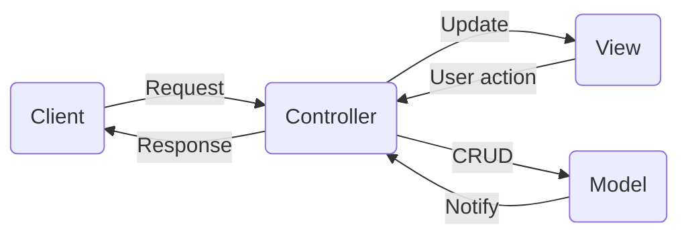
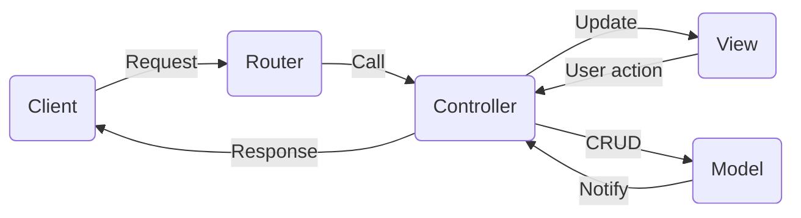

# 「PHPプログラミング勉強会」(応用編)--`MVC`に基づく開発


## 1. なぜMVCが必要なのか

- Webアプリケーションでは、クライアントからの**リクエスト**に対して、**複雑な処理**を経て**結果を表示**することが一般的な流れ。

- これらをすべてひとつのプログラムに集約することが、小規模で処理ロジックが簡単なケースしか対応できず、システムが大規模・複雑になるにつれ、プログラムが肥大化しやすく、開発効率が悪化したり、保守コストが高くなったりする要因になる。


- **MVC**は、リクエストに対して、**データ処理**（`Model`）と**画面表示** （`View`）を分割し、さらに全体の流れを**制御する役割**（`Controller`）を役割別に分けてプログラムを組む仕組みである。



※`CRUDとは、業務データに対する基本操作の略称： Create（登録）, Retrieve（検索）, Update（更新）, Delete（削除）`

## 2. Webサーバの基礎

- Webサーバとは、HTTPに則り、クライアントソフトウェアのウェブブラウザに対して、HTMLやオブジェクト（画像など）の表示を提供するサービスプログラム及び、そのサービスが動作するサーバコンピュータを指す。 広義には、**クライアントソフトウェアとHTTPによる通信を行うプログラム及びコンピュータ**
- Webサーバの主な役割は、ブラウザからのリクエスト（要求・`Request`）を受け取り、HTMLファイルや画像ファイルをレスポンス（`Response`）として返すこと

### 2.1 `Request`と`Response`に関する情報を調べる 

`Request`と`Response`に関する情報は、以下の`PHP`定義済変数で調べることができる

- `$_SERVER`：サーバー情報および実行時の環境情報に関する連想配列。
  - `$_SERVER['PHP_SELF']`：PHPスクリプトのファイル名（例：`index.php`）
  - `$_SERVER['REQUEST_URI']`：HTTPリクエスト（例：`/spl2025/u/detail/2`）
  - `$_SERVER['REQUEST_METHOD']`：HTTPリクエストのメソッド（例：`GET`, `POST`等）
- `$_GET`：URL パラメータで現在のスクリプトに渡された変数の連想配列
- `$_POST`：POST リクエストから得られるフォームデータ
- `$_COOKIE`：現在のスクリプトに HTTP クッキーから渡された変数の連想配列
- `$_REQUEST`：`$_GET`、 `$_POST` そして `$_COOKIE` の内容をまとめた連想配列
- `$_SESSION`：現在のスクリプトで使用できるセッション変数を含む連想配列
- `$_FILES`：ファイルアップロード変数（ファイル名、タイプ、サイズ等）

### 2.2 Webサーバの機能を制御する設定ファイル

1. `httpd.conf`：Apache Serverの設定ファイル、サーバーの基本的な動作や機能を設定する。例えば、**基本情報の定義**（サーバー名、IPアドレス、ポート番号の設定）、**ディレクトリとアクセス制御**（どのディレクトリを公開するか・ドキュメントルートや、どのIPアドレスからのアクセスを許可/拒否するかの設定）

2. `.htaccess`：ディレクトリ単位で制御するための設定ファイル、主な役割は、URLの変更に伴うリダイレクト、特定のディレクトリへのアクセス制限（パスワード認証やIPアドレス制限）などが挙げられる

  - **例１：フォルダにパスワード認証を設定**

  `/var/www/html/phpstudy2025/.htaccess`

  ```htaccess
  AuthUserFile "/home/hoge/.htpasswd"
  AuthName "Please enter your ID and Password." 
  AuthType BASIC 
  require valid-user 
  ```
  `/home/hoge/.htpasswd`(**ログインIDと暗号化されたパスワードを保存するファイル**）

  ```htaccess
  phpstudy2025:$apr1$5LfSx54q$Zbhx7mcqdIhT.ATXTiIuL/
  ```

  - **例2：実在しないフォルダ(`!-d`)やファイル(`!-f`)へのアクセスをすべて`index.php`へ転送**

      `/var/www/html/spl2025mvc/.htaccess`

  ```htaccess
  RewriteEngine On
  RewriteCond %{REQUEST_FILENAME} !-d
  RewriteCond %{REQUEST_FILENAME} !-f
  RewriteRule ^(.+)$ index.php [QSA,L] # QSA:クエリ文字列を付けて転送, L: これが最後のルール
  ```

3. `php.ini`：PHPの動作や環境をカスタマイズするための設定ファイルです。`php.ini`を編集することで、メモリ制限、ファイルアップロードの許容量、実行時間、文字コード、エラー表示、セキュリティ関連の機能など、PHPの様々な設定を調整できる。


## `3．MVC` + `Router`によるWebアプリケーション開発



1. **ルーター（Router）**：
   ルーターが、リクエストを解析して、コントローラーに必要な情報（クラス名、メソッド名、パラメータ）を提供する。

   **メリット**：

   - ①実際のパスを隠してセキュリティ性が高まる。
   - ② URLが簡潔でわかりやすくなる。例：
     
   `GET: /spl2025mvc/s/list`：`Student`コントローラーの`list`アクションで、学生を一覧する
   `GET: /spl2025mvc/s/update/3`：`Student`コントローラーの`update`アクションで、`id=3`の学生データを編集する
   `POST: /spl2025mvc/s/save` : `Student`コントローラーの`save`アクションで、送信された学生データを保存する

2. **コントローラー（Controller）**：

   Routerの解析結果に基づき、特定のコントローラーのアクションを呼び出し、クライアントのリクエストを適切に処理する。

   コントローラーが、モデルとビューを引数としてインスタンスが生成されているので、モデルやビューのメソッドを呼び出すことができる。

3. **モデル（Model）**：

   モデルが、コントローラーの要求に応じて、渡された引数を使い、データベースと連携しながら処理を行う。処理結果をコントローラーに返す。

4. **ビュー（View）**：

   ビューが、コントローラーの指示に従い、①渡されたデータを使い画面を描画するか、②別の画面に遷移する（例えば、ログイン成功後、トップページに遷移する）


## 4. 名前空間について

### 4.1 名前空間とは

PHPの名前空間は、クラス名や関数名などの衝突を防ぎ、コードを論理的にグループ化するための仕組み。`namespace` キーワードで定義され、名前空間が異なれば同じ名前のクラスや関数を重複して使用できる。これにより、大規模な開発や外部ライブラリの使用時に、名前の競合を回避することが可能。 

主な特徴

- **競合の防止**: 同じ名前のクラスや関数が複数定義されても、名前空間が異なれば競合エラーは発生しない。
- **コードの整理**: クラスや関数を論理的なグループにまとめることができ、コードの管理が容易。
- **外部ライブラリとの互換性**: 外部ライブラリのクラス名と自分のコードのクラス名が衝突するのを防ぐことができる。 

名前空間の定義と使用法

- **定義方法**: `namespace` キーワードの後に名前空間名を指定。
  **ファイル名：**`namespace_sample.php`

  ```php
  <?php
  
  namespace MyProject;
  
  class MyClass { 
  
  }
  ```

  

- **名前空間の指定**: 名前空間内の要素にアクセスするには、`名前空間名\クラス名` のように指定する。

  ```php
  <?php
  include 'namespace_sample.php';
  // 名前空間を宣言していないファイルから呼び出す場合
  $obj = new MyProject\MyClass();
  ```

### 4.2 Composerによる`autoload`

`Composer`とは、**PHPのライブラリを管理するツール**。　`Composer`を使うことによって別のファイルを読み込む時に***オートロード(自動クラス読み込み)***してくれる。`Composer`は`composer.json`というファイルに書かれた`autoload`設定によって、名前空間とソースコードの保存先と関連付けることができ、必要なファイルを自動的にロード（`require`、`include`）してくれる。

**Composerツールは「Webプログラミング演習」の開発環境に導入済みで、ターミナルから実行できる **

**ファイル名：**`composer.json` 

```json
{
    "name": "myproj/composer_test",
    "autoload": {
        "psr-4": {
            "MyProject": "src/"
        }
    },
   
    "require": {}
}
```

以下のコマンドを実施すると、上記の設定が適用される

```sh
$ composer install
```

実行後は、`vendor`というフォルダが生成される。また、最新状態を記録する`composer.lock`というファイルも生成される。

そうしたら、明示的に`include`を使わなくとも`namespace_sample.php`が自動的に読み込まれる

```php
<?php
// 名前空間を宣言していないファイルから呼び出す場合
$obj = new MyProject\MyClass();
```
